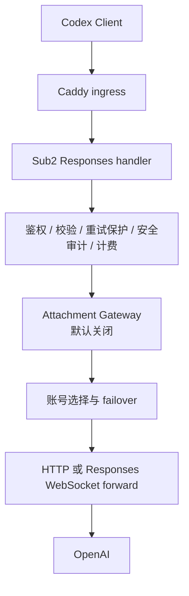
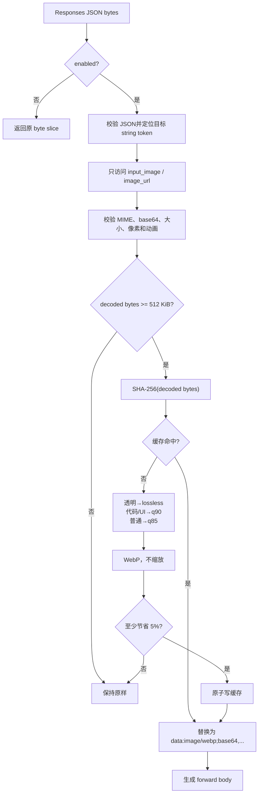

# Sub2 Attachment Gateway Phase 1 实现计划

日期：2026-07-20
状态：本地实验实现已落地，功能默认关闭；未连接生产服务器，未修改生产配置或 Caddy。

> **后续状态说明**：本文保留实现前计划。当前功能提交 `888badf71608` 已进入生产镜像，
> 仅 API Key 27 与 admin user 1 使用 scoped rewrite；Responses 入站为 256,000,000 B，
> 实际上游仍限制为 16,000,000 B。最新状态见 `attachment_gateway_current_status.md`。

Phase 1.1 更新：灰度 allowlist、dry-run、5 秒 fail-open 时间预算、请求总图片
bytes 限制、缓存 TTL/容量清理和 HTTP/WS 本地端到端矩阵均已实现。当前发布边界与
操作步骤见 `attachment_gateway_production_canary.md`。生产 CGO0 构建已固定
`embed nodynamic`，并通过 linux/amd64 最终 Alpine 镜像启动与回环测试；同一标签
也已覆盖 backend Makefile 与完整/简化 GoReleaser 构建。

## 1. 决策摘要

Phase 1 选择在 **Responses handler 编排点调用独立 service**，而不是做全局 middleware，也不把图片处理散落到 handler 或账号 forward 循环中。

原因如下：

- handler 已经持有完成鉴权后的完整 JSON body，并知道请求平台、端点和安全审计结果；
- 同一 logical request 只需优化一次，账号 failover 可以复用同一个优化结果；
- 原始 body 可继续用于异常重试指纹、安全审计、session hash 和计费判断；
- forward 层位于账号重试循环内，若在那里压缩会重复消耗 CPU，并使不同账号尝试的 payload 不易保持一致；
- 全局 middleware 缺少 Responses、OpenAI/Grok、compact 等协议语义，误伤面过大。

模块放在：

```text
backend/internal/service/attachment_gateway/
  detector.go
  image_optimizer.go
  cache.go
  types.go
  gateway.go
```

handler 只负责开关、调用和隐私安全指标日志：

```text
backend/internal/handler/openai_attachment_gateway.go
```

## 2. 当前请求链路

CCSwitch 在本项目中是 Codex provider 配置导入控制面；已确认的运行时链路是：



Responses 图片输入仍是 `application/json`。OpenAI 官方文档确认，`input_image` 可使用完整 URL、Base64 data URL 或 `file_id`，并支持 PNG、JPEG、WebP 等格式。Phase 1 仅改写以下内联形式，输出仍为官方支持的 data URL：

```json
{
  "type": "input_image",
  "image_url": "data:image/png;base64,..."
}
```

参考：[OpenAI Images and vision](https://developers.openai.com/api/docs/guides/images-vision)。

## 3. HTTP 插入位置

`OpenAIGatewayHandler.Responses` 中的顺序为：

```text
读取原始 body
  → JSON / model / stream 校验
  → abnormal retry protection
  → security audit
  → image-generation 权限与并发判断
  → billing eligibility re-check
  → Attachment Gateway（仅 OpenAI 裸 Responses）
  → model mapping
  → account selection / failover loop
  → forward
```

实现约束：

- 仅 `PlatformOpenAI`；Grok 不改写；
- 仅裸 `/responses` 路径；`/responses/compact` 不改写；
- 优化发生在账号 failover 循环之前，`forwardBody` 在所有账号尝试中复用；
- `body` / `sessionHashBody` 始终保持原始内容；
- 开关关闭时不解析 JSON、不访问缓存、不重编码 body。

这使附件优化只改变 Sub2 发往上游的 wire payload，不改变安全、风控或会话粘连口径。

## 4. WebSocket / ctx_pool 插入位置

Phase 1 同时覆盖客户端 Responses WebSocket 的**首个** `response.create` frame：

```text
读取首 frame
  → JSON / model 校验
  → security audit
  → billing eligibility
  → 用原始 frame 生成 session hash
  → Attachment Gateway
  → account selection / ctx_pool、passthrough 或 HTTP bridge
```

首轮优化结果在账号 failover 中复用。后续 turn 暂不优化：现有 `BeforeRequest` hook 的契约只能返回校验错误，不能返回替换后的 payload。未经设计就修改 hook 会扩大 WS 核心链路风险，因此 Phase 1 明确保留这一边界。

## 5. Attachment Gateway 数据流



实现只把发生变化的 image URL JSON string token 拼接回原 body，不把整份文档解码为 `map[string]any`。这样既避免把无关大整数转换为 `float64` 后舍入，也保留未修改字段的原始 JSON bytes，并减少一个大 body 解析缓冲区。

## 6. 图片策略

| 输入 | 处理 |
|---|---|
| decoded bytes `< 512 KiB` | 原样转发 |
| 普通 PNG/JPEG/WebP | WebP q85 |
| 高边缘、有限色板的疑似代码/UI 截图 | WebP q90 |
| 含透明度的图 | lossless WebP |
| 节省不足 5% | 原样转发 |
| 动画、坏 base64、超限、无法解码 | 单图 fail-open |

任何策略都不改变宽高，也不修改请求中的 `detail`。

## 7. 缓存设计

默认目录：

```text
data/attachment_cache/
  <source_sha256>.webp
  <source_sha256>.json
```

hash 对象是 decoded image bytes，不是 base64 字符串。metadata 包含：

- `original_hash` / `optimized_hash`；
- 原始与优化大小；
- 原始与优化 MIME；
- 宽、高、quality、lossless；
- policy 与 optimizer 版本；
- `created_at` / `expires_at`。

缓存文件使用 `0600`、目录使用 `0700`，临时文件写完并 `fsync` 后原子 rename。进程内使用 `singleflight` 防止同一 hash 并发重复编码。请求侧 Base64/decode 工作受
请求槽限制，singleflight worker 另持有实际 decode/encode 槽；因此第三方编码器即使
在请求 deadline 后才返回，也不会提前释放真实编码并发额度。

Phase 1.1 已实现默认 512 MiB 容量、7 天 TTL 和 10 分钟节流的异步清理：只扫描
64 位小写十六进制 `.webp`/`.json` pair，删除过期/损坏 pair，并按创建时间淘汰最旧
entry；未知文件、临时文件和 orphan 不删除。跨进程文件锁与多实例共享缓存仍未实现，
因此当前只允许单内部 key 的小流量 canary，不能直接作为全量生产缓存设计定稿。

## 8. 指标与日志

事件名：`openai.attachment_gateway_experiment`。

仅记录：

- `original_body_bytes` / `optimized_body_bytes`；
- `image_count` / `optimized_image_count`；
- `original_image_bytes` / `optimized_image_bytes`；
- `cache_hit` / `cache_hits` / `cache_shared`；
- `optimize_duration_ms` / `errors`。

禁止记录 body、base64、图片 bytes、prompt、source hash、optimized hash 或缓存路径。

## 9. 配置与关闭语义

```yaml
gateway:
  attachment_gateway:
    attachment_optimizer_enabled: false
```

完整实验参数已加入 `deploy/config.example.yaml`，但默认值为 `false`。关闭时：

- 返回原始 byte slice；
- 不做 JSON parse/marshal；
- 不创建缓存目录；
- 不产生日志事件；
- 不校验或初始化未启用的实验调优值，休眠配置不会阻止启动；
- 不改变 HTTP/WS 路由、账号选择或 forward 行为。

## 10. 风险与验证重点

1. **Caddy 前置 413**：工作区保存的 `../Caddyfile.remote-current` 快照含 `10MB` body limit 和 `Content-Length > 10000000` 的 413；Sub2 内优化无法处理未进入 handler 的请求。
2. **同步 CPU 与内存**：JSON、base64、decoded bytes、完整 raster、WebP 和重编码 JSON 会同时存在。
3. **缓存隐私**：优化图仍可能包含源码、终端、账号信息；TTL 不等于主动删除。
4. **缓存生命周期**：TTL 与容量回收已实现；仍缺生产磁盘告警、删除 SLA 和多实例
   跨进程协调。
5. **多进程 stampede**：`singleflight` 仅覆盖当前 Go 进程。
6. **WS 后续 turn**：本阶段只覆盖首轮。
7. **真实视觉质量**：必须补真实模型 OCR、代码、UI 和普通图片 A/B，离线代理不能替代。
8. **平台性能差异**：纯 Go `nodynamic` 与 linux/amd64 Alpine 功能已验证，但生产
   Xeon 的原生 p95/p99、CPU 与 RSS 仍必须通过内部 canary 采集。

验证结果和进入下一阶段的判定分别见：

- `docs/reports/attachment_gateway_phase1_report.md`
- `docs/reports/attachment_gateway_next_step.md`
