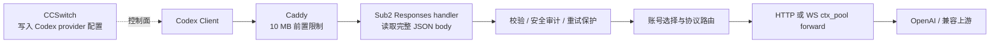

# Sub2 Attachment Gateway 调研报告

日期：2026-07-20
范围：本地源码与离线实验；未连接生产服务器，未修改生产配置，未调用 OpenAI 付费接口。
基线：`fork/main`，本地 HEAD `04200f20b`。

## 结论先行

Attachment Gateway 方向值得继续，但必须先把目标拆成两件事：

1. **减少 Sub2 → OpenAI 的请求体、重试流量和上游 413**：在 Sub2 内压缩 base64 图片有效。本地 POC 将一条 14,106,892 B 请求压到 1,029,505 B，降幅 92.7%。
2. **消除 Client → Caddy 的 10 MB 入站 413**：只在 Sub2 内压缩无效，因为请求到达 Sub2 前已经被 Caddy 拒绝。要解决这一类 413，需要把优化移到客户端/本地代理，或谨慎提高 Caddy 入站上限让原始请求先进入 Sub2；更成熟的长期方案是客户端直传对象存储再提交 URL。

建议第一版不做 R2：先保留图片为较小的 `data:image/webp;base64,...`，配合本地 SHA-256 缓存，验证上游请求体、重试率和 `read_upstream` 是否改善。URL 化只做第二阶段实验。

当前 POC **不应直接接入生产核心链路**；它适合作为可合并的 `experiments/` 证据。生产版需先解决 CPU、缓存隔离、路由兼容和 Caddy 前置限制。

## 1. 当前请求结构

### 1.1 OpenAI Responses 图片输入

Responses 请求是 `application/json`。典型图片结构为：

```json
{
  "model": "gpt-5.6-terra",
  "input": [
    {
      "role": "user",
      "content": [
        {"type": "input_text", "text": "描述这张图"},
        {
          "type": "input_image",
          "image_url": "data:image/png;base64,...",
          "detail": "high"
        }
      ]
    }
  ]
}
```

OpenAI 官方文档确认，Responses 图片可通过三种方式提供：

- 完整的 HTTPS 图片 URL；
- Base64 data URL；
- Files API 返回的 `file_id`。

同一 `content` 数组可包含多张图片；官方当前列出的输入格式包括 PNG、JPEG、WebP 和非动画 GIF。参考：[Images and vision](https://developers.openai.com/api/docs/guides/images-vision)。

### 1.2 文件与其他附件

Responses 的文件项使用 `input_file`，当前官方形式包括：

```json
{"type":"input_file","file_id":"file-..."}
{"type":"input_file","file_url":"https://.../document.pdf"}
{"type":"input_file","filename":"document.pdf","file_data":"data:application/pdf;base64,..."}
```

参考：[File inputs](https://developers.openai.com/api/docs/guides/file-inputs)。本次 POC 只处理 `input_image.image_url`，不处理 PDF、文档、音频、视频或 `input_file`。

### 1.3 Multipart

`/v1/responses` 当前走 JSON handler，不是 multipart。项目中 multipart 解析位于独立的 Images API 路径（例如 `/v1/images/edits`），不能把它与 Responses 附件混为一条处理链。第一版 Attachment Gateway 不应拦截 multipart；若以后优化 Images API，应另设限额和测试集。

### 1.4 图片进入 Sub2 后是否仍可读取

可以，但前提是请求已经通过 Caddy 和 Go 的 body limit：

- `backend/internal/server/routes/gateway.go:168` 注册 `/v1/responses`；
- `backend/internal/handler/openai_gateway_handler.go:213` 将请求完整读取为 `[]byte`；
- `backend/internal/handler/openai_gateway_handler.go:316` 生成账号尝试共用的 `forwardBody`；
- `backend/internal/handler/openai_gateway_handler.go:475` 调用 OpenAI forward service；
- `backend/internal/service/openai_gateway_forward.go:986` 用最终 body 构造上游 HTTP 请求。

项目现有代码已经识别 `input_image`、`image_url`，并会清理空 base64 图片。Responses → Anthropic 兼容桥在 `backend/internal/pkg/apicompat/responses_to_anthropic_request.go:389` 读取 data URL。

默认应用级限制为 256 MiB（`server.max_request_body_size` 与 `gateway.max_body_size`），压缩请求还受 64 MiB 解压上限约束。真正更早的限制来自工作区保存的 Caddy 生产快照 `../Caddyfile.remote-current`。

## 2. 当前处理链路与 CCSwitch 的真实位置

CCSwitch 在当前项目中主要是**控制面配置导入器**，不是已证明存在的请求代理层。`frontend/src/utils/ccswitchImport.ts` 生成 Codex 配置，把 `base_url` 直接指向 Sub2，并设置 `supports_websockets = true`。因此运行时链路更准确地表示为：



因此不能假设“把逻辑放进 CCSwitch”就已具备本地代理能力；若要在 Caddy 前压缩，需要 CCSwitch 新增本地代理/sidecar，或由 Codex 客户端原生提供附件预处理。

### 2.1 生产快照中的 10 MB 前置门

工作区快照 `../Caddyfile.remote-current` 包含两层约束：

- `request_body { max_size 10MB }`；
- 当 `Content-Length > 10000000` 时直接返回 413。

也就是说，14 MB JSON 不会到达 Sub2 handler。Sub2 内的 Attachment Gateway 能减少上游传输，却不能追回已经发生的入站 413。

### 2.2 插入层比较

| 位置 | 能看到什么 | 优点 | 风险/缺点 | 结论 |
|---|---|---|---|---|
| 全局 middleware | 原始 body、路由前信息 | 覆盖广 | 缺少协议、账号、平台语义；会影响所有大请求；容易重复读 body | 不推荐 |
| Responses handler | 已鉴权的完整 JSON、原始 body、session hash | 每请求只处理一次；可在 failover 前复用；便于保留原始审计口径 | 仍在 Caddy 之后；URL 化时尚不知道最终账号 | **适合 data URL 压缩与缓存** |
| forward 层 | 已选账号、真实平台、HTTP/WS 决策 | 可安全决定 URL 化是否兼容该上游 | failover 可能重复处理；过晚会增加 CPU 和复杂度 | **适合账号相关的最终替换** |

推荐做成两段式 service，而不是把图片逻辑散落在 handler：

1. handler 在原始 body 完成鉴权、异常重试保护和安全审计后，调用一次 `PrepareAttachments`：检测、解码、hash、压缩、缓存；仍返回较小 data URL。
2. 账号选择后按平台调用 `MaterializeAttachmentsForRoute`：只有 OpenAI 原生 Responses 路径才允许把缓存项替换成 HTTPS URL；Anthropic bridge、未知兼容网关继续使用 data URL。

原始 body 应保留给异常重试指纹、审计、session hash 和流量统计；优化 body 只用于上游转发。

## 3. 图片优化方案判断

完整测试见 [attachment_optimizer_test.md](./attachment_optimizer_test.md)。关键结论：

| 方法 | 三类样本节省范围 | 单图耗时范围（本机） | 判断 |
|---|---:|---:|---|
| oxipng `-o4` | 12.9%–32.7% | 1.25–1.99 s | 真无损，但不足以解决 14 MB 级问题 |
| zopflipng | 12.2%–38.0% | 24.3–67.2 s | 真无损，在线路径不可接受 |
| pngquant q80–95 | 61.2%–73.0% | 0.16–0.52 s | 效果好，但它是有损调色板量化，不应称作无损 |
| JPEG q80–90 | 图片相关；代码 PNG 反而增大 | 0.02–0.04 s | 照片可用，不适合统一策略与透明图 |
| WebP q80–90 | 38.6%–97.0% | 0.09–0.16 s（代表性小图） | 综合最好，支持透明度，推荐首选 |

建议的内容策略：

- 照片/插画：WebP q85；
- UI 截图：WebP q85–90；
- 代码、小字、OCR 敏感图：优先 WebP q90 或 WebP lossless；
- 已经很小、已是高效 WebP、或节省不足 5%：保持原样；
- 不改变像素尺寸，不修改原请求的 `detail`；
- 动画 GIF、超大解码尺寸、坏 base64：失败放行并记录指标。

原因是新版模型在 `detail=auto/original` 下可能保留更多原始空间细节；盲目缩放像素比更换编码格式更容易伤害代码截图、图表和 computer-use 场景。

## 4. 本地 hash 缓存设计

POC 已验证以下布局：

```text
image_cache/
  <source-sha256>.webp
  <source-sha256>.metadata.json
```

metadata 字段包括：

```json
{
  "original_hash": "...",
  "optimized_hash": "...",
  "original_size": 10579969,
  "optimized_size": 771930,
  "original_media_type": "image/png",
  "optimized_media_type": "image/webp",
  "width": 2500,
  "height": 2100,
  "quality": 85,
  "optimizer": "Pillow-12.2.0/webp",
  "created_at": "...",
  "expires_at": "..."
}
```

设计要点：

- hash 对象是**解码后的原始图片字节**，避免同一图片因 base64 换行不同而重复缓存；
- 命中时同时校验质量策略、编码器版本、文件长度和优化后 SHA-256；
- 原子写入，目录与文件 owner-only；
- TTL 默认 7 天仅为实验值，生产需按隐私要求缩短并加入容量上限/LRU；
- 多进程需要 singleflight/文件锁，避免 cache stampede；
- 多实例若继续只用本地盘，同一图片会重复压缩；先观察命中率，再决定共享存储；
- 不把 data URL、原图、签名 URL 或 API key 写入日志。

本地 POC 的大图冷处理约 1.35 s，缓存命中约 64 ms；缓存显著有效，但命中仍需 base64 解码、全图 SHA-256、读取缓存和重新 base64 编码。

## 5. URL 化可行性

### 5.1 OpenAI 与 Codex

OpenAI 官方 Responses 文档明确支持 `input_image.image_url` 使用完整 URL，因此 OpenAI 原生路径可行。Codex 客户端不需要理解替换后的 URL：它先发原请求，Sub2 在上游转发前改写即可。

但是项目的 Responses → Anthropic bridge 只把 data URI 转换为 Anthropic image source；把 URL 提前替换后，该 bridge 可能丢图。因此 URL 化必须晚于账号/平台选择，或严格限定 OpenAI 原生组。

### 5.2 是否需要签名 URL

生产中建议需要。图片可能包含源码、终端、账号信息或用户私有材料。单纯公开 `<sha256>.webp` 会形成可长期访问、可关联的稳定标识。最低要求：

- 短期签名/HMAC URL；
- TTL 覆盖排队、上游抓取和有限重试，建议先测 15–60 分钟；
- 禁止目录列表，设置正确 `Content-Type`、`X-Content-Type-Options: nosniff`；
- 到期清理与审计；
- URL 日志脱敏，查询签名不落普通 access log；
- 如果 OpenAI 会异步抓取，不能在收到响应头后立即删除对象。

### 5.3 三种存储比较

| 方案 | 优点 | 缺点 | 当前建议 |
|---|---|---|---|
| 本地文件缓存 + Caddy | 最低复杂度；可复用现有服务器；适合验证 URL 抓取 | 仍占 5 Mbps VPS 出站；单机盘、蓝绿切换和签名路由复杂；需公开 HTTPS | 第二阶段小范围验证 |
| Cloudflare R2 | 可卸载 VPS 图片出站；生命周期与对象存储能力完整 | 需凭据、签名、权限、生命周期和故障处理；会扩大首版范围 | **暂不做**，效果证明后再接 |
| S3 兼容对象存储 | 标准 presigned URL，供应商选择多 | 可能有出网费、区域延迟与兼容差异 | 与 R2 同阶段比较 |

URL 化可把 14.1 MB JSON 缩到几百字节，但图片本身仍要由 OpenAI 从存储读取。它减少 API request body 和重试放大，不会让图片传输成本归零。

## 6. 最小 Demo

位置：`experiments/attachment_optimizer/`

开关默认值：

```json
"attachment_optimizer_enabled": false
```

关闭时 POC 返回原始 `bytes`，不解析、不重新序列化。开启后：

```text
JSON body
  → 递归检测 input_image/image_url
  → 校验 data URL、MIME、大小与非动画图
  → decoded bytes SHA-256
  → 本地缓存命中则复用
  → WebP q85
  → 仅在至少节省 5% 时替换
  → 输出较小 data URL 或实验 URL
```

POC 不被 Sub2 runtime import，也没有注册路由、配置项、middleware 或 forward hook，因此不会影响现有用户。

## 7. 与 WS `ctx_pool` 的关系

两个机制解决的问题不同：

| 机制 | 主要解决 | 不解决 |
|---|---|---|
| Attachment Gateway | 单次图片/文件 body 太大；图片在重试中的重复上传 | 长文本上下文、连接建立、服务端会话状态 |
| WS `ctx_pool` | WebSocket 连接复用、上下文/响应 ID 连续性、连接和部分上下文开销 | `response.create` 中再次携带的 base64 图片字节 |

源码证据：`backend/internal/service/openai_ws_forwarder_ingress.go:746` 的 `sendAndRelay` 会把整条 payload 写入上游 WS，并在日志记录 `payload_bytes`；`read_upstream` 是随后读取上游事件的阶段。连接池复用不会自动对 payload 内的 base64 做内容寻址。

建议测试矩阵：

| 优化 | 传输 | 观察项 |
|---|---|---|
| 关 | HTTP | body bytes、上游 413、TTFT、failover/retry |
| 关 | ctx_pool | WS payload bytes、连接复用率、`read_upstream`、TTFT |
| 开 | HTTP | 压缩 CPU、cache hit、body bytes、上游 413、TTFT |
| 开 | ctx_pool | WS payload bytes、cache hit、`read_upstream`、TTFT |

本次没有连接真实 WS 上游，因而没有声称 `read_upstream` 或 TTFT 已改善；只能确认应用层 payload 会变小。应继续推进 ctx_pool，但把它作为互补项目，不作为附件压缩的替代品。

## 8. 技术风险

1. **Caddy 前置 413**：Sub2 内优化无法解决；必须先识别 413 来源。
2. **CPU 与尾延迟**：大图冷压缩在 M1 Pro/Python POC 已约 1.35 s，2 vCPU 旧 Xeon 可能更慢。生产需 worker pool、并发上限、超时和 fail-open。
3. **内存复制**：JSON、base64 字符串、decoded bytes、像素 raster、encoded bytes 会同时存在；一张 10 MB PNG 解码为 2500×2100 RGB 已约 15.8 MB，单请求峰值远高于文件大小。
4. **图像质量**：代码、图表、UI 坐标与 OCR 对压缩伪影敏感，不能只看体积。
5. **透明度/动画/色彩空间**：需要保持 alpha、ICC/EXIF 取舍并拒绝动画输入。
6. **协议分支**：OpenAI URL 与 Anthropic bridge 行为不同；自定义 OpenAI-compatible 上游也可能拒绝 WebP/URL。
7. **隐私**：缓存和公开 URL 都会延长敏感图片生命周期。
8. **缓存一致性**：算法/quality 改变必须使旧缓存失效；多实例需防重复压缩。
9. **计费与审计口径**：保留 original bytes、optimized bytes、wire bytes 三套指标，不应覆盖原始重试指纹和审计 body。
10. **错误放大**：压缩失败不能触发同账号反复重试；应直接原图放行或明确返回本地错误。

## 9. 推荐路线

### 阶段 0：先观测

- 给 413 标记来源：Caddy、Sub2 body limit、上游账号代理、OpenAI；
- 记录原始 logical body bytes、图片数、base64 decoded bytes、重复 hash 次数；
- 不记录图片内容；
- 以现有异常重试保护为兜底，避免相同大 body 无限重放。

### 阶段 1：最小生产候选（仍默认关闭）

- 仅 OpenAI Responses JSON；
- 仅 `input_image.image_url=data:image/...;base64,...`；
- 阈值建议从 512 KiB 或 1 MiB 起；
- WebP q85/90 + 代码截图保守策略；
- 本地 SHA-256 cache、TTL、容量上限、singleflight；
- 失败放行；
- 请求级压缩总时限与 worker pool；
- 保留原 body 做审计/指纹；
- 暂时仍输出 data URL，不需要 R2。

若要让现有 10 MB Caddy 下的 14 MB 请求成功，必须另选其一：

- 开发 Codex/CCSwitch 本地预处理代理；或
- 只对 `/v1/responses` 做有边界的 Caddy 灰度上限调整，让原 body 进入 Sub2，再验证上游缩小；或
- 客户端通过预签名 URL 直传对象存储。

本任务不执行这些生产变更。

### 阶段 2：URL 化验证

- 仅 OpenAI 原生账号；
- 本地 Caddy 静态访问 + 短签名 URL；
- 验证 OpenAI 抓取、重试、TTL、删除时机和蓝绿切换；
- 对比 data URL 与 URL 的端到端 TTFT、失败率和 VPS TX。

### 阶段 3：再决定 R2

只有在以下证据成立后再接 R2：

- 图片优化命中率高；
- 上游 413/带宽保护明显下降；
- 本地静态访问成为 VPS 出站或可用性瓶颈；
- 隐私、签名、生命周期需求已经稳定。

## 10. 最终建议

- **是否值得合并**：方向值得；当前 POC 只建议合并在 `experiments/`，不应直接接生产 forward。完成阶段 0 指标和受控灰度设计后，再做默认关闭的生产候选。
- **第一版功能**：Responses base64 图片检测、WebP/保守截图策略、decoded-byte SHA-256、本地 TTL cache、失败放行、CPU/命中率/体积指标；保持 data URL。
- **是否需要 R2**：第一版不需要。R2 不能自动解决 Client → Caddy 413，除非配合客户端直传。
- **是否继续 ctx_pool**：继续。它解决连接与长上下文重复传输，和 Attachment Gateway 互补；需要用四象限矩阵独立验收。

## 资料

- OpenAI 官方：[Images and vision](https://developers.openai.com/api/docs/guides/images-vision)
- OpenAI 官方：[File inputs](https://developers.openai.com/api/docs/guides/file-inputs)
- 本地测试数据：[attachment_optimizer_benchmark.json](./data/attachment_optimizer_benchmark.json)
- 本地测试报告：[attachment_optimizer_test.md](./attachment_optimizer_test.md)
